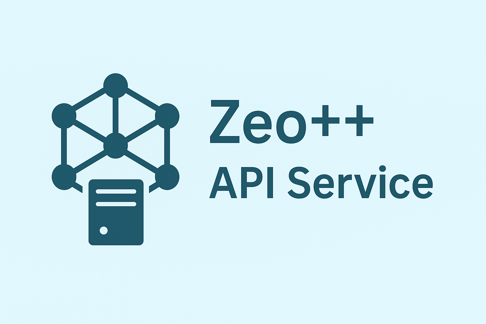

<div align="center">
  <a href="https://github.com/lichman0405/zeopp-backend.git">
    
  </a>
  
  <h1 align="center">Zeo++ API Service</h1>
  
  <p align="center">
    一个生产级的 FastAPI 服务，将强大的 Zeo++ 结构分析功能封装为现代化、容器化的 HTTP 端点。
    <br>
    <a href="./README-en.md"><strong>English</strong></a>
    ·
    <a href="https://github.com/lichman0405/zeopp-backend.git/issues">报告 Bug</a>
    ·
    <a href="https://github.com/lichman0405/zeopp-backend.git/issues">提出新特性</a>
  </p>
</div>

<div align="center">

[](https://opensource.org/licenses/MIT)
[](https://www.python.org/)


[](https://github.com/lichman0405/zeopp-backend/issues)
[](https://github.com/lichman0405/zeopp-backend.git])

</div>

该项目解决了直接使用 Zeo++ 的一些痛点：它将复杂的命令行操作转变为简单的 API 调用，并提供自动缓存、结构化输出及易于部署的容器化环境。

## 🚀 核心功能

- ✅ **现代化的 API**：通过 HTTP 接口访问 Zeo++ 的核心分析功能。
- 🧠 **智能缓存**：自动缓存计算结果，相同输入秒回，避免重复计算。
- 📂 **结构化输出**：返回易处理的 JSON 响应，数据类型清晰。
- ⚙️ **配置灵活**：通过 `.env` 文件轻松配置 Zeo++ 路径与工作目录。
- 🐳 **Docker 就绪**：使用 Docker 和 docker-compose 一键启动服务，自动处理 Zeo++ 下载与编译。
- 🎨 **丰富的日志**：美观且信息丰富的控制台日志，方便调试与监控。

## ⚡ 快速上手

### 环境要求

- Docker 和 Docker Compose  
  或
- Python 3.9+

### 方式一：使用 Docker（推荐）

#### 创建配置文件

复制 `.env.example`（如不存在请创建）为 `.env` 文件。一般情况下无需修改默认配置。

```ini
# .env
ZEO_EXEC_PATH=network
ZEO_WORKSPACE=workspace
ENABLE_CACHE=true
```

#### 一键启动

在项目根目录运行：

```bash
docker-compose up --build
```

Docker 将自动构建镜像（含 Zeo++ 下载与编译），并启动服务。服务将运行在 [http://localhost:8000](http://localhost:8000)。

### 方式二：本地开发（不使用 Docker）

#### 安装 Zeo++

请确保已根据官方指引安装 Zeo++，并能通过 `network` 命令在终端调用。

#### 安装依赖

```bash
python -m venv venv
source venv/bin/activate
pip install -r requirements.txt
```

#### 配置环境

创建 `.env` 文件，确保 `ZEO_EXEC_PATH` 指向您的 Zeo++ 可执行文件。

#### 运行服务

```bash
uvicorn app.main:app --reload
```

## 📋 使用示例

项目启动后，可使用任何 HTTP 客户端调用 API。

### 测试健康检查

```bash
# 基本健康检查
curl http://localhost:9876/health

# 详细健康检查
curl http://localhost:9876/health/detailed

# 获取版本信息
curl http://localhost:9876/version
```

### 调用分析端点

示例：使用 curl 计算孔径

```bash
curl -X 'POST' \
  'http://localhost:9876/api/v1/pore_diameter' \
  -H 'accept: application/json' \
  -H 'Content-Type: multipart/form-data' \
  -F 'structure_file=@/path/to/your/file.cif' \
  -F 'ha=true'
```

请将 `/path/to/your/file.cif` 替换为本地结构文件路径。参数（如 `ha=true`）以表单字段 `-F` 形式发送。

### 交互式文档

访问 Swagger UI 进行交互式测试：[http://localhost:9876/docs](http://localhost:9876/docs)

## 📚 API 参考

### 系统端点

| 路径 | 功能 |
| --- | --- |
| `/health` | 基本健康检查，验证服务运行状态 |
| `/health/detailed` | 详细健康检查，包含系统信息和 Zeo++ 可用性 |
| `/version` | 获取 API 版本信息 |

### 核心几何学分析（v1 API）

所有端点均需上传 `structure_file` 文件。

| 路径 | 功能 |
| --- | --- |
| `/api/v1/pore_diameter` → Zeo++ `-res` | 计算最大可及球（Di）和最大包含球（Df）直径 |
| `/api/v1/surface_area` → Zeo++ `-sa` | 使用蒙特卡洛采样计算可及表面积 |
| `/api/v1/accessible_volume` → Zeo++ `-vol` | 计算给定探针的可及体积 |
| `/api/v1/probe_volume` → Zeo++ `-volpo` | 计算特定点/区域的探针可占据体积 |
| `/api/v1/channel_analysis` → Zeo++ `-chan` | 识别和分析通道 |
| `/api/v1/pore_size_dist/download` → Zeo++ `-psd` | 下载孔径分布直方图的数据文件 |
| `/api/v1/blocking_spheres` → Zeo++ `-block` | 识别不可及区域并生成阻塞球 |

### 结构信息分析（v1 API）

| 路径 | 功能 |
| --- | --- |
| `/api/v1/framework_info` → Zeo++ `-strinfo` | 识别结构中框架数量及其维度 |
| `/api/v1/open_metal_sites` → Zeo++ `-oms` | 计算开放金属位点数量 |

## 🔄 版本说明

**当前版本：v0.3.0**

### 新增特性（v0.3.0）
- ✅ API 版本控制：所有分析端点现在使用 `/api/v1/` 前缀
- ✅ 健康检查端点：`/health` 和 `/health/detailed`
- ✅ 改进的错误处理：使用自定义异常类型，提供更详细的错误信息
- ✅ 版本信息端点：`/version`

## 📜 许可证

MIT © Shibo Li, 2025
